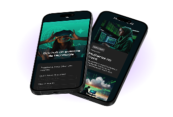

# Tecboard 📊 — Real-Time Monitoring

<p align="center">
  
  
  
</p>

**Tecboard** is a modern and responsive landing page developed as part of a practical project from **Alura**. The application promotes a fictional real-time infrastructure monitoring platform, focusing on smart alerts and high availability for systems.

The main slogan summarizes the tool's goal: **"Keep an eye on what matters"**.

---

## 📌 Table of Contents

- [Tecboard 📊 — Real-Time Monitoring](#tecboard---real-time-monitoring)
  - [📌 Table of Contents](#-table-of-contents)
  - [⚙️ Features](#️-features)
  - [🎨 Design and Interface](#-design-and-interface)
  - [🛠️ Technologies Used](#️-technologies-used)
  - [📂 Project Structure](#-project-structure)
  - [🚀 How to Run the Project](#-how-to-run-the-project)
    - [Step 1: Clone the repository](#step-1-clone-the-repository)
    - [Step 2: Open the project](#step-2-open-the-project)
  - [🎓 Credits and Learnings](#-credits-and-learnings)
  - [📄 License](#-license)

---

## ⚙️ Features

- **Responsive Design:** Ready for fluid display on mobile devices and desktops.
- **Modern Visual Identity:** Refined typography and a dark color palette with high contrast in white and neon/purple tones.
- **Call to Action (CTA):** A dedicated button directing users to test the demo version of the system.
- **Performance Optimization:** Pre-connection to external fonts (Google Fonts) for faster loading times.

---

## 🎨 Design and Interface

The page has a clean and straightforward structure:
1. **Header:** Contains the official Tecboard logo in its white version.
2. **Main Section:** 
   - High-impact title with visual emphasis (`<span>`).
   - Clear description of real-time monitoring and smart alerts.
   - Conversion link/button (*Call to Action*).
   - High-resolution illustrative image featuring overlapping smartphones with shadow effects.



---

## 🛠️ Technologies Used

The project was built using the following technologies and resources:

- **HTML5:** Semantic structuring of tags (`<header>`, `<main>`, `<section>`).
- **CSS3:** Styling, positioning, and visual effects (imported via `css/style.css`).
- **Google Fonts:** Custom fonts integrated directly to elevate the design level:
  - **Poppins:** For body text and descriptions (clean and fluid reading).
  - **Unbounded:** For titles and highlights (modern and technological style).
- **Custom Favicon:** SVG format icon (`favicon-branco.svg`) configured for the browser tab.

---

## 📂 Project Structure

Below is the file organization of the repository:

```text
.
├── index.html               # Main project page
├── favicon-branco.svg       # Browser tab icon
├── css/
│   └── style.css            # CSS stylesheet
└── img/
    ├── Logo-branco.png      # Header logo
    └── celulares-sobrepostos-desktop.png # Main highlight image
```
---

## 🚀 How to Run the Project

Since this repository contains only static files (essential Front-end), you don't need to install any heavy dependencies.

### Step 1: Clone the repository
Open your terminal and run the following command:

```bash
git clone [https://github.com/YOUR_USERNAME/REPOSITORY_NAME.git](https://github.com/YOUR_USERNAME/REPOSITORY_NAME.git)
```

### Step 2: Open the project
Navigate to the created folder and open the `index.html` file in any web browser (Chrome, Edge, Firefox, Safari):

```bash
cd REPOSITORY_NAME

Or simply double-click the 'index.html' file using your file explorer.
```

💡 **Pro Tip:** If you are using **VS Code**, install the **Live Server** extension. Just right-click on `index.html` and select *"Open with Live Server"* to see your code changes reflect automatically in the browser without needing to refresh the page.

---

## 🎓 Credits and Learnings
This project was developed based on the Front-end courses by Alura, one of the largest technology platforms in Brazil. During development, it was possible to consolidate concepts such as:

The importance of semantics in HTML5.

File organization and relative paths for images/styles.

Integration and optimization of external fonts via Google Fonts.

---

## 📄 License
This project is under the MIT license. See the LICENSE file for more details, if applicable.